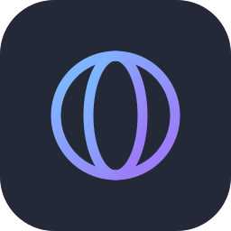
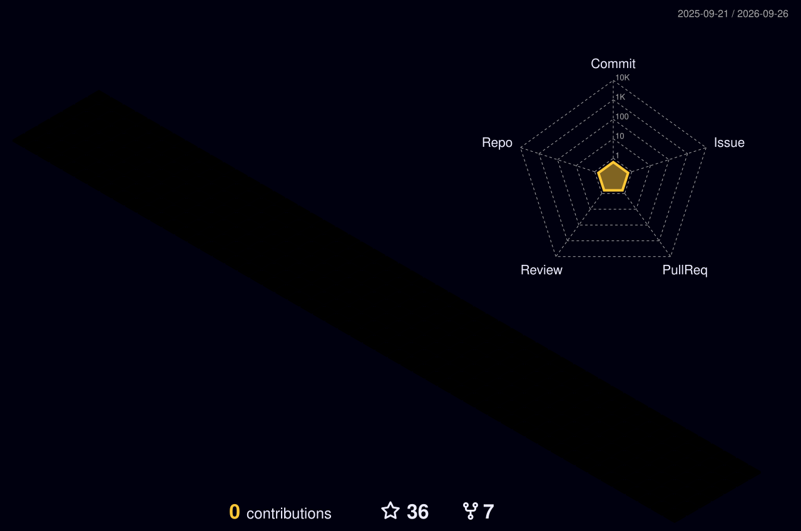

 
 

 
 

&nbsp;

&nbsp;

&nbsp;

&nbsp;

&nbsp;

&nbsp;

&nbsp;

 

&nbsp;

 

&nbsp;

I'm a **Senior Software Engineer** who builds frontend systems designed to survive scale — currently handling frontend at **Simpplr**, previously shipping products for 3+ years at **Antino**.

### 🚀 What I actually do

- 🏗️ **Architect from scratch** — Build scalable React.js & Next.js platforms with SSR/CSR, Micro Frontends, and reusable Component Libraries.
- 🤖 **AI-Native Development** — Leverage AI agents, MCPs, Cursor, and automation to accelerate engineering while keeping humans in control of architecture and code quality.
- ⚡ **Obsess over performance** — Optimize Core Web Vitals, bundle size, rendering, caching, and runtime performance to deliver fast user experiences.
- 🔐 **Ship secure** — Build secure-by-default applications with authentication, authorization, secure APIs, XSS/CSRF protection, and dependency hygiene.
- 🌱 **Mentorship** — Help engineers grow through architecture reviews, code reviews, pair programming, and engineering best practices.
- 🎤 **Speaker** — Share practical insights on modern frontend architecture, AI workflows, and engineering productivity at meetups and community events.
- ✍️ **Engineering Blogs** — Write about deep dives on React, Next.js, frontend architecture, AI-assisted development, and interview experiences.

 

 

&nbsp;

  

<table>
<tr>
<td align="center" width="33%" valign="top">
<b>⚛️ State & Data</b>  

</td>
<td align="center" width="33%" valign="top">
<b>✨ Motion & Visualization</b>  

</td>
<td align="center" width="33%" valign="top">
<b>📝 Forms & Validation</b>  

</td>
</tr>
<tr>
<td align="center" width="33%" valign="top">
<b>📊 Tables & Grids</b>  

</td>
<td align="center" width="33%" valign="top">
<b>🛠️ Tools & Security</b>  

</td>
<td align="center" width="33%" valign="top">
<b>🧪 Testing</b>  

</td>
</tr>
<tr>
<td align="center" colspan="3" valign="top">
<b>🤖 AI-Native Tooling</b>  

</td>
</tr>
</table>

 
 

 

 

  

🎓 **B.Tech in Information Technology** · Gandhi Institute of Engineering & Technology, Odisha · 2018–2022 · CGPA 8.23

 

<!-- ⭐ ANIMATED TIMELINE — beam sweeps the track, nodes light up, cards fade in -->

 

<!-- ⭐ 3D CONTRIBUTION MODEL — generated by .github/workflows/profile-3d.yml -->
<!--  -->

  

  

  

  

<!-- Snake — generated by .github/workflows/snake.yml -->

